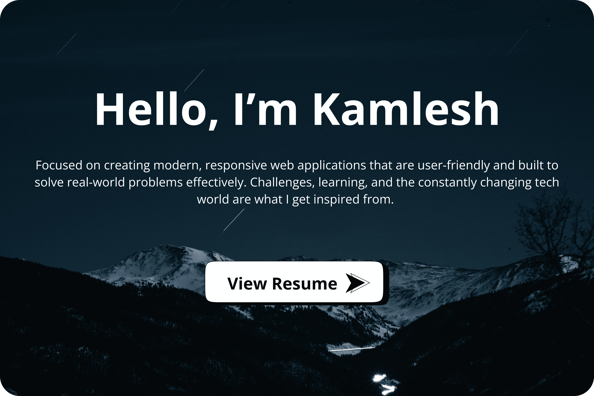
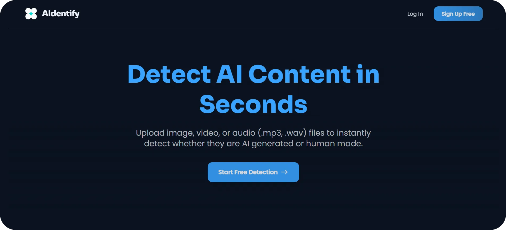
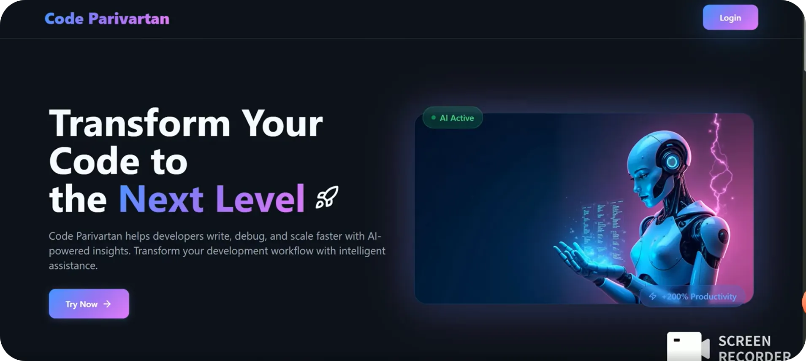
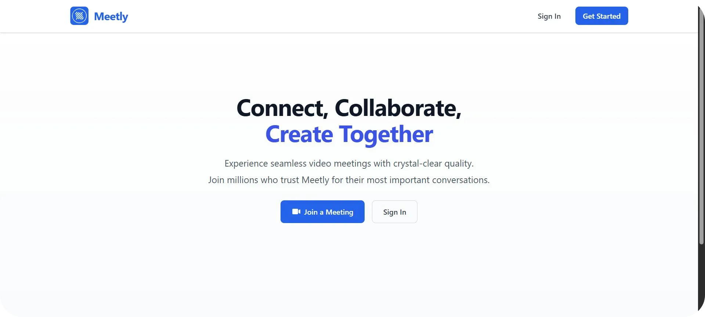
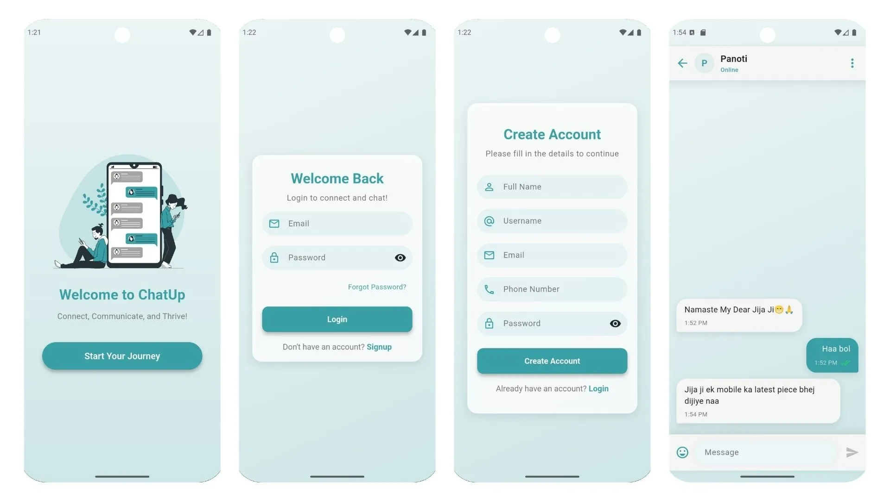

  

  <b><i>I'm always open to discussing freelance opportunities, collaborations, or just chatting about tech. Let's connect!</i></b>  
  
  
  

## 🚀 Projects

  <table style="width: 100%; max-width: 900px; border-collapse: collapse;">
    <tr>
      <td width="50%" valign="middle" style="padding: 15px;">
        
      </td>
      <td width="50%" valign="middle" style="padding: 15px 25px;">
        <h3 style="margin-top: 0;">AIdentify</h3>
        
An advanced detection tool designed to analyze media and accurately determine if it is AI-generated.

        
<b>Tech Stack:</b> Next.js, TypeScript, Python, MongoDB, Gemini

      </td>
    </tr>
    <tr>
      <td width="50%" valign="middle" style="padding: 15px;">
        
      </td>
      <td width="50%" valign="middle" style="padding: 15px 25px;">
        <h3 style="margin-top: 0;">Code Parivartan</h3>
        
An Agentic AI tool that automatically improves, updates, and adds new features to any public GitHub repository based on simple text prompts.

        
<b>Tech Stack:</b> Python, Flask, Gemini, GitHub, Next.js, TypeScript

      </td>
    </tr>
    <tr>
      <td width="50%" valign="middle" style="padding: 15px;">
        
      </td>
      <td width="50%" valign="middle" style="padding: 15px 25px;">
        <h3 style="margin-top: 0;">Meetly</h3>
        
A comprehensive video conferencing platform featuring seamless scheduling, secure real-time communication, and interactive meeting tools.

        
<b>Tech Stack:</b> React, WebRTC, Socket.io, JavaScript

      </td>
    </tr>
    <tr>
      <td width="50%" valign="middle" style="padding: 15px;">
        
      </td>
      <td width="50%" valign="middle" style="padding: 15px 25px;">
        <h3 style="margin-top: 0;">ChatUp</h3>
        
A secure, cross-platform chat application delivering instant real-time messaging and robust user authentication.

        
<b>Tech Stack:</b> Flutter, Dart, Firebase, BLoC, Cubit

      </td>
    </tr>
  </table>

 

## 💻 Tech Stack

**Languages:**

     

**Frontend & Mobile:**

         

**Backend & Databases:**

          

**AI, Machine Learning & Data:**

     

**DevOps, Tools & Hosting:**

      
