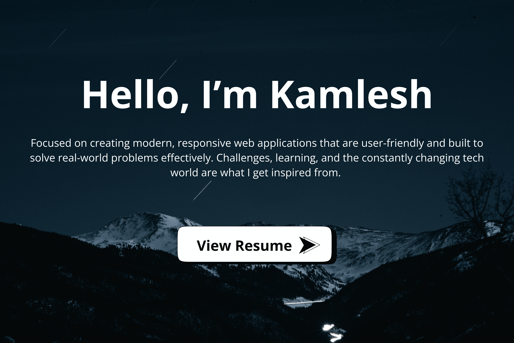
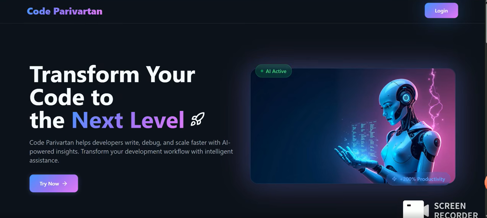
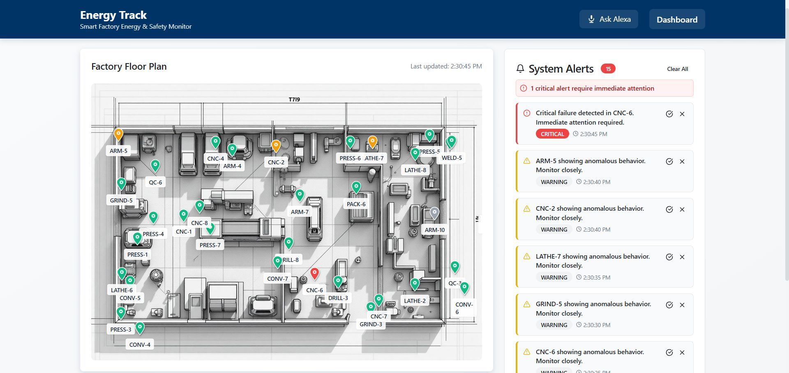
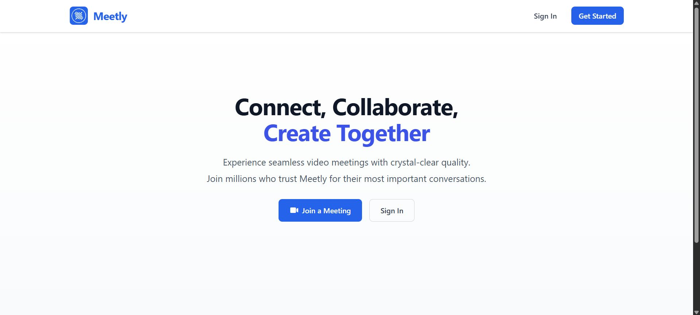
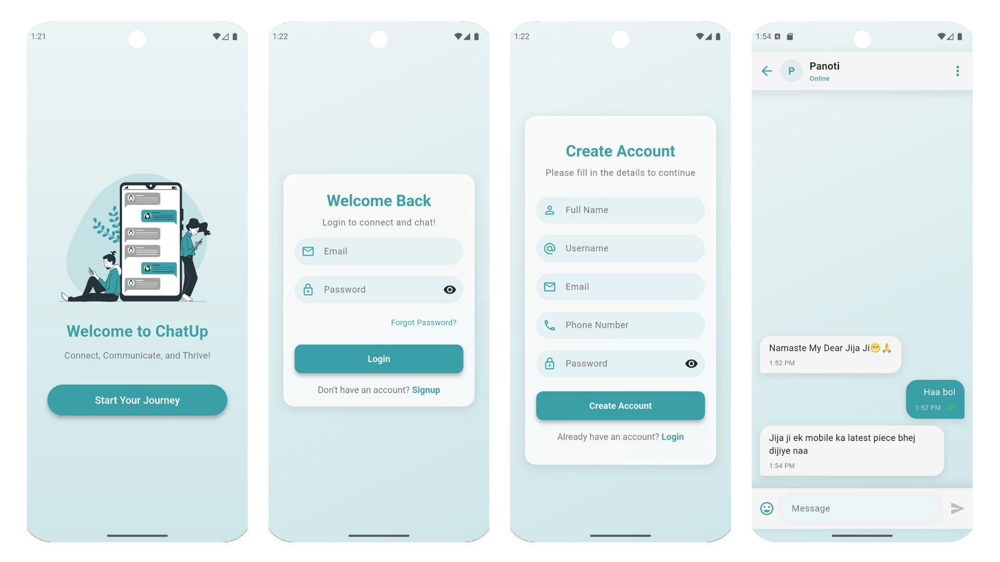

 
 

<h2>Projects</h2>

  <table style="border-collapse: collapse; width: 100%; max-width: 900px;">
    <tr>
      <!-- Project 1 -->
      <td style="padding: 16px; width: 50%; vertical-align: top; text-align: left;">
        
        
        
      </td>
      <!-- Project 2 -->
      <td style="padding: 16px; width: 50%; vertical-align: top; text-align: left;">
        
        
        
      </td>
    </tr>
    <tr>
      <!-- Project 3 -->
      <td style="padding: 16px; width: 50%; vertical-align: top; text-align: left;">
        
        
        
      </td>
      <!-- Project 4 -->
      <td style="padding: 16px; width: 50%; vertical-align: top; text-align: left;">
        
        
        
      </td>
    </tr>
  </table>
  <!-- View More Button -->
  

    
  

 
 

<h3>Tools & Tech</h3>

  

 
 

<h2>GitHub Stats</h2>

  
  

 
 

<h2>Let's Connect</h2>

  
  &nbsp;&nbsp;
  

<i>Feel free to reach out for collaborations, freelance projects, or just a tech chat!</i>

